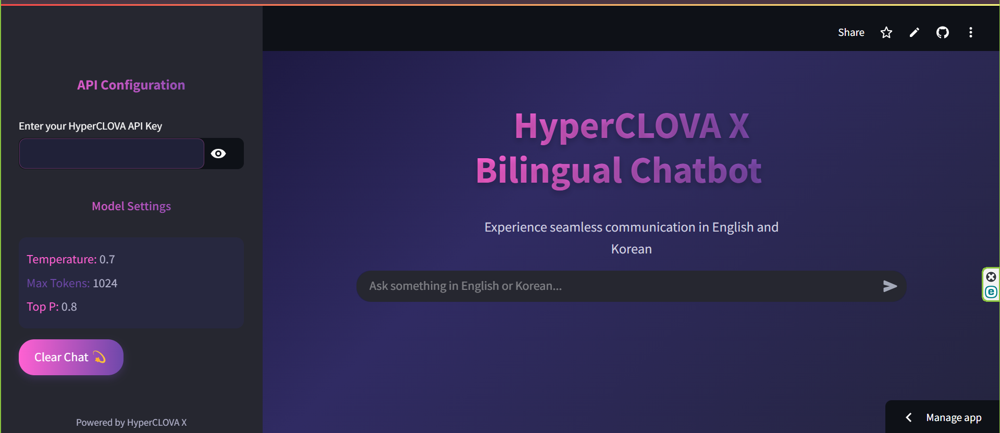

<h1 align="center">✨ HyperCLOVA X Bilingual Chatbot ✨</h1>

<div align="center">
  
  
  
  
  
  
  
  [](https://opensource.org/licenses/MIT)

  <p>A beautiful bilingual chatbot powered by NAVER's HyperCLOVA X, providing seamless communication in both English and Korean 🇬🇧 🇰🇷</p>

<div align="center">
  
</div>
</div>

## ✨ Features

| 🌈 Feature | 📝 Description |
|------------|---------------|
| 🔄 **Bilingual Responses** | Automatic dual-language answers in English and Korean |
| 🎨 **Stunning UI** | Beautiful gradient dark theme with responsive design |
| 🔌 **HyperCLOVA X Integration** | Powered by NAVER's advanced language model |
| 🔑 **Simple API Setup** | Easy configuration with your API key |
| 🔄 **Chat History** | Persistent conversation tracking |
| 🧠 **Context Awareness** | AI maintains context throughout the conversation |

## 💫 Live Demo

Check out the live demo of the HyperCLOVA X Bilingual Chatbot:

[🔗 Live Demo](https://hyperclova-bilingual-chatbot.streamlit.app/)

## 🚀 Installation

```bash
# Clone the repository
git clone https://github.com/yourusername/hyperclova-bilingual-bot.git

# Navigate to the project directory
cd hyperclova-bilingual-bot

# Install dependencies
pip install -r requirements.txt

# Run the application
streamlit run app.py
```

## 🔧 Requirements

```
streamlit>=1.24.0
requests>=2.28.1
streamlit-extras>=0.2.7
```

## 🔑 API Configuration

To use this application, you'll need a HyperCLOVA X API key from NAVER Cloud:

1. Create an account on [NAVER Cloud Platform](https://www.ncloud.com/)
2. Subscribe to the HyperCLOVA X service
3. Generate an API key from your dashboard
4. Enter the API key in the application sidebar

The UI features:

- 🌈 Beautiful gradient background
- 🌙 Dark theme for reduced eye strain
- 💬 Elegant chat bubbles with shadow effects
- 🔣 Special formatting for Korean text sections
- 📱 Fully responsive design for all devices

## 🌟 Key Components

```python
# Main features of the application
- Real-time bilingual responses
- Persistence of chat history using Streamlit session state
- Custom styling with CSS for an elegant UI
- HyperCLOVA X API integration
- Graceful error handling
```

## 🤝 Contributing

Contributions are welcome! Please feel free to submit a Pull Request.

1. Fork the repository
2. Create your feature branch (`git checkout -b feature/amazing-feature`)
3. Commit your changes (`git commit -m 'Add some amazing feature'`)
4. Push to the branch (`git push origin feature/amazing-feature`)
5. Open a Pull Request

## 📄 License

This project is licensed under the MIT License - see the [LICENSE](LICENSE) file for details.

## 🙏 Acknowledgements

- [NAVER HyperCLOVA X](https://www.ncloud.com/product/aiService/clovaStudio) for providing the powerful language model
- [Streamlit](https://streamlit.io/) for the amazing web app framework
- [Streamlit Extras](https://github.com/arnaudmiribel/streamlit-extras) for additional components

<div align="center">
  <p>❤️ Made with love for language enthusiasts, Korean learners, and AI explorers</p>
</div>
